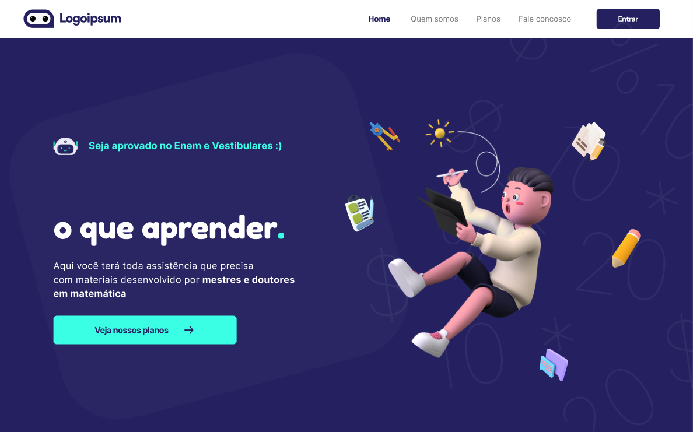

<p align="center">
  
</p>

<p align="center">
     
</p>

<h1 align="center">
    
</h1>

<br>

## 🧪 Tecnologias

Esse projeto foi desenvolvido com as seguintes tecnologias:

- [React](https://reactjs.org)
- [TypeScript](https://www.typescriptlang.org/)

## 🚀 Como executar

Clone o projeto e acesse a pasta do mesmo.

```bash
$ git clone https://github.com/arthurfortunato/Desafio-Landing-Page.git
$ cd Desafio-Landing-Page
```

Para iniciá-lo, siga os passos abaixo:
```bash
# Instalar as dependências
$ yarn 

# Iniciar o projeto
$ yarn start 
```
O app estará disponível no seu browser pelo endereço http://localhost:3000.


## 💻 Projeto

Projeto com o objetivo de replicar o layout da landing page no Figma, deixando responsivo para Web e Mobile.


 **[Layout Figma](https://www.figma.com/file/ESJgBz1dpcImjUwe4pcLex/Desafio?node-id=0%3A1)**.


## 📝 License

Esse projeto está sob a licença MIT. Veja o arquivo [LICENSE](LICENSE.md) para mais detalhes.

---